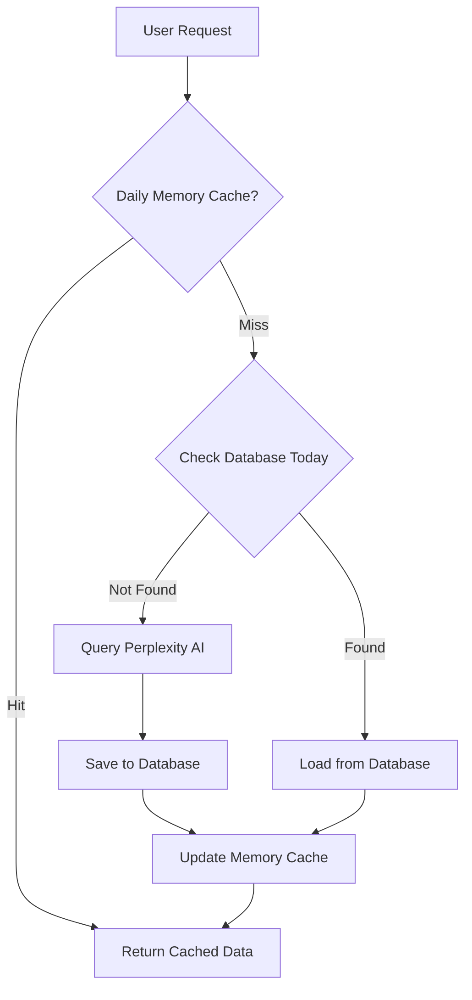

# Steel Sector AI Dashboard - Technical Documentation

## Project Overview

This is an AI-powered dashboard for monitoring steel sector commodity markets relevant to Vietnam. It uses Perplexity AI to gather and analyze market data with an intelligent daily caching system to minimize API costs while maintaining fresh data.

## Architecture

### System Design

```
┌─────────────┐       ┌──────────────┐       ┌──────────────┐
│  Streamlit  │ ───── │  Orchestrator│ ───── │ Perplexity AI│
│  Dashboard  │       │   (Daily     │       │     API      │
└─────────────┘       │   Cache)     │       └──────────────┘
       │              └──────────────┘              ↑
       │                     │                      │
       ↓                     ↓                      │
┌─────────────┐       ┌──────────────┐             │
│    Data     │       │   SQLite     │ ────────────┘
│  Processor  │ ───── │   Database   │  (Only if no cache)
└─────────────┘       └──────────────┘
```

### Data Flow - Daily Caching Strategy



**Detailed Flow:**

1. **Level 1 - Memory Cache**: Check if today's data exists in memory (instant)
2. **Level 2 - Database**: If not in memory, check SQLite for today's data
3. **Level 3 - API Query**: Only query Perplexity if data not found
4. **Persistence**: Save results immediately to database after API query
5. **Cache Update**: Keep in memory for the rest of the day

## Core Components

### 1. Perplexity Client (`src/api/perplexity_client.py`)

**Purpose**: Handles all communication with Perplexity AI API using JSON-structured queries

**Key Methods**:
```python
query_commodity(commodity, timeframe, query_type) -> Dict
batch_query(commodities, timeframe) -> List[Dict]
```

**Query Format**:
```python
f"""Summarize the most important news from the last {timeframe} about {commodity}.
Focus on price changes, demand/supply drivers, government policies, and trade flows.
Include implications for the Vietnamese steel market where relevant.

Output in JSON format as:
{{
    "commodity": "{commodity}",
    "current_price": "USD 115/ton",
    "price_change": "+2.5%",
    "trend": "bullish",
    "key_drivers": ["driver1", "driver2", "driver3"],
    "recent_news": ["news1 with date", "news2 with date"],
    "source_urls": [
        "https://www.reuters.com/markets/commodities/full-article-url",
        "https://tradingeconomics.com/commodity/specific-news-article",
        "https://www.mining.com/web/exact-article-link"
    ]
}}

IMPORTANT: Provide complete, clickable URLs for source_urls, not just website names.
"""
```

**Features**:
- Single comprehensive JSON query for all data needs
- Robust JSON extraction with fallback parsing
- Retry logic with exponential backoff
- Timeframe support ("1 week" or "1 month")

### 2. Query Orchestrator (`src/api/commodity_queries.py`)

**Purpose**: Manages queries with intelligent caching

**Key Methods**:
```python
query_all_commodities(timeframe, force_refresh) -> List[Dict]
query_single_commodity(commodity_name, timeframe, force_refresh) -> Dict
```

**Caching Strategy**:
- **Daily Cache**: Dictionary stored in memory, cleared on app restart
- **Database First**: Always checks database before making API calls
- **Force Refresh**: Option to bypass cache when needed
- **Automatic Saving**: Results saved to database immediately after query

### 3. Database Storage (`src/storage/database.py`)

**Purpose**: Persistent storage with daily caching support

**Database Schema**:
```sql
-- Query results table
CREATE TABLE query_results (
    id INTEGER PRIMARY KEY,
    commodity_name TEXT,
    timeframe TEXT,
    query_timestamp TIMESTAMP,
    success BOOLEAN,
    current_price TEXT,
    price_change TEXT,
    trend TEXT,
    key_drivers TEXT,  -- JSON array
    recent_news TEXT,  -- JSON array
    sources TEXT,      -- JSON array
    raw_response TEXT
)

-- Price history table
CREATE TABLE price_history (
    id INTEGER PRIMARY KEY,
    commodity_name TEXT,
    price_value REAL,
    price_unit TEXT,
    price_date DATE
)
```

**Key Methods**:
```python
get_today_results(commodity_name, timeframe) -> Optional[Dict]
get_all_today_results(timeframe) -> List[Dict]
save_query_results(results, timeframe) -> bool
```

### 4. Data Processor (`src/processing/data_processor.py`)

**Purpose**: Formats JSON-structured data for display

**Key Functions**:
- Direct JSON field mapping to table columns
- Trend visualization with icons (📈 📉 ➡️)
- News formatting with date preservation
- Driver text truncation and formatting
- Export to JSON/CSV/Markdown

**Data Processing**:
- Table: Uses `current_price`, `price_change`, `key_drivers`, `trend`
  - Extracts domain names from `source_urls` for clean display
- News Cards: Uses `recent_news` array with embedded dates
  - Displays full clickable URLs from `source_urls`
  - Links open in new tabs with styled appearance
- Source handling: Automatic domain extraction for display while preserving full URLs for navigation

### 5. Streamlit Dashboard (`app.py`)

**Purpose**: User interface with real-time updates

**Features**:
- Timeframe selection (1 week / 1 month)
- Three refresh modes:
  - Get Today's Data (uses cache)
  - Force Refresh (new API query)
  - Clear Cache (reset all)
- Visual feedback on data source
- Export functionality

## Configuration

### Environment Variables (.env)
```bash
PERPLEXITY_API_KEY=your_key_here
```

### Configuration File (config.yaml)
```yaml
commodities:
  - name: "iron ore"
    query_keywords: ["iron ore 62% Fe", "Chinese ports"]
    vietnam_specific: true

dashboard:
  default_timeframe: "1 week"
  
database:
  cleanup_days: 90
```

## Commodities Tracked

Steel sector focus:
1. **Iron Ore** - Primary raw material
2. **Coking Coal** - Essential for steel production
3. **Scrap Steel** - Recycled material input
4. **Steel Rebar** - Construction steel product
5. **Hot Rolled Coil (HRC)** - Flat steel product

## JSON Response Format

### Expected Response Structure
```json
{
    "commodity": "Iron Ore (iron ore 62% Fe)",
    "current_price": "USD 116/ton",
    "price_change": "+1.8%",
    "trend": "bullish",
    "key_drivers": [
        "China stimulus optimism boosting steel demand",
        "Weather disruptions in Australia limiting supply",
        "Vietnam infrastructure spending increasing consumption"
    ],
    "recent_news": [
        "Jan 4: China's steel mills increase production by 5%",
        "Jan 3: Cyclone warnings for Western Australia iron ore ports",
        "Jan 2: Vietnam announces $2B highway construction project"
    ],
    "source_urls": [
        "https://www.reuters.com/markets/commodities/china-steel-production-rises-2025",
        "https://www.mining.com/web/cyclone-threatens-australian-iron-ore-exports",
        "https://tradingeconomics.com/vietnam/infrastructure-spending",
        "https://www.steelorbis.com/steel-news/latest-news/vietnam-highway-project-2025"
    ]
}
```

### Field Descriptions
- **commodity**: Name of the commodity being analyzed
- **current_price**: Latest spot price with unit
- **price_change**: Percentage or absolute change over timeframe
- **trend**: Market direction (bullish/bearish/stable)
- **key_drivers**: 3-4 main market factors
- **recent_news**: Dated news items (3-4 most important)
- **source_urls**: Full clickable URLs to source articles (not just homepages)

## API Usage Optimization

### Cost Reduction Strategy

1. **Single Comprehensive Query**: One query provides both table and news data
2. **Daily Queries Only**: Each commodity queried maximum once per day
3. **Database Persistence**: Results stored for 90 days
4. **Memory Cache**: Prevents database queries during the same session
5. **JSON Format**: Structured responses reduce parsing errors

### Example Cost Calculation
```
Without caching:
- 5 commodities × 2 timeframes × 10 refreshes/day = 100 API calls/day

With daily caching + JSON:
- 5 commodities × 2 timeframes × 1 query/day = 10 API calls/day
- 90% reduction in API costs
- Faster response processing due to structured format
```

## Development Guidelines

### Adding New Commodities

1. Update `config.yaml`:
```yaml
- name: "new_commodity"
  display_name: "New Commodity"
  category: "Category"
  unit: "USD/ton"
  query_keywords: ["keyword1", "keyword2"]
```

2. Update `commodity_queries.py` if needed for special handling

### Testing

Run tests:
```bash
python -m pytest tests/
```

### Logging

Logs are written to `logs/commodity_dashboard.log`

Log levels:
- INFO: Normal operations
- WARNING: Cache misses, retries
- ERROR: API failures, database errors

### Performance Monitoring

Monitor these metrics:
- Cache hit rate (should be >90% after first query)
- API response time
- Database query time
- Dashboard load time

## Troubleshooting

### Common Issues

1. **No data displayed**
   - Check Perplexity API key
   - Verify internet connection
   - Check logs for errors

2. **Stale data**
   - Use "Force Refresh" button
   - Check system date/time
   - Verify database write permissions

3. **Slow performance**
   - Check database size (run cleanup)
   - Monitor API response times
   - Review memory usage

### Debug Mode

Enable detailed logging:
```python
# In app.py
logging.basicConfig(level=logging.DEBUG)
```

## Maintenance

### Daily Tasks
- Monitor API usage
- Check error logs

### Weekly Tasks
- Review cache hit rates
- Analyze price trends

### Monthly Tasks
- Database cleanup (automatic)
- Performance review
- Update commodity keywords if needed

## Future Enhancements

Potential improvements:
1. Historical trend charts
2. Price alerts via email
3. Multi-user support
4. Advanced analytics
5. Integration with other data sources
6. Mobile app version

## ⚠️ SSL Certificate Hotfix (REMOVE FOR PRODUCTION)

**IMPORTANT: This section documents temporary SSL bypass for testing environments. These changes MUST be removed before production deployment.**

### Current SSL Bypass Locations:

1. **File: `src/api/perplexity_client.py`**
   - **Lines 14-18**: Disabled SSL warnings
   ```python
   # ⚠️ REMOVE THESE LINES FOR PRODUCTION:
   import urllib3
   urllib3.disable_warnings(urllib3.exceptions.InsecureRequestWarning)
   ```
   
   - **Lines 194-203**: Disabled SSL verification in API calls
   ```python
   # ⚠️ REMOVE verify=False FOR PRODUCTION:
   response = self.session.post(
       ...,
       verify=False  # ⚠️ REMOVE THIS LINE
   )
   ```

### To Remove SSL Bypass for Production:

1. **Remove the urllib3 warning suppression** (lines 14-18 in perplexity_client.py)
2. **Remove `verify=False` parameter** from the session.post() call (line 203)
3. **Configure proper SSL certificates** using one of these methods:
   - Install system certificates: `sudo apt-get install ca-certificates`
   - Set certificate bundle path in environment: `REQUESTS_CA_BUNDLE=/path/to/cert.pem`
   - Use Python's certifi: `pip install --upgrade certifi`

### Why This Hotfix Exists:

This temporary bypass was added to handle SSL certificate verification errors in development/testing environments, particularly:
- Corporate networks with self-signed certificates
- Development environments with proxy/firewall issues
- Local testing environments with certificate chain problems

### Security Risk:

**WARNING**: Running with SSL verification disabled means:
- No verification of server identity
- Vulnerable to man-in-the-middle attacks
- No encryption verification
- **NOT SUITABLE FOR PRODUCTION USE**

## Security Considerations

1. **API Key Protection**: Never commit `.env` file
2. **Database Access**: Local SQLite, no network exposure
3. **Input Validation**: All user inputs sanitized
4. **Rate Limiting**: Built into orchestrator
5. **Data Privacy**: No sensitive data stored
6. **SSL Verification**: Currently disabled for testing (see SSL Hotfix section above)

## Support

For issues or questions:
1. Check this documentation
2. Review logs in `logs/` directory
3. Verify configuration files
4. Test API connectivity

## License

Internal use only - Dragon Capital

---

*Last Updated: 2025*