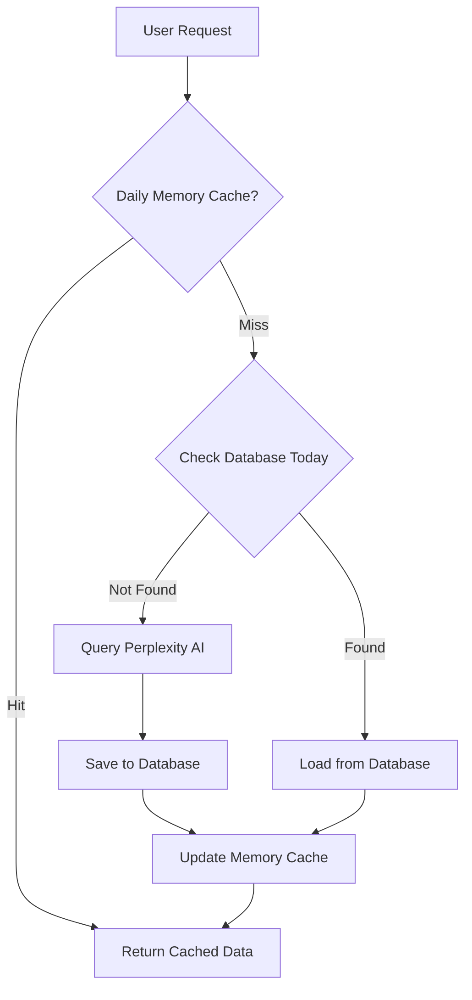

# Steel Sector AI Dashboard - Technical Documentation

## Project Overview

This is an AI-powered dashboard for monitoring steel sector commodity markets relevant to Vietnam. It uses Perplexity AI to gather and analyze market data with an intelligent daily caching system to minimize API costs while maintaining fresh data.

## Architecture

### System Design

```
┌─────────────┐       ┌──────────────┐       ┌──────────────┐
│  Streamlit  │ ───── │  Orchestrator│ ───── │ Perplexity AI│
│  Dashboard  │       │   (Daily     │       │     API      │
└─────────────┘       │   Cache)     │       └──────────────┘
       │              └──────────────┘              ↑
       │                     │                      │
       ↓                     ↓                      │
┌─────────────┐       ┌──────────────┐             │
│    Data     │       │   SQLite     │ ────────────┘
│  Processor  │ ───── │   Database   │  (Only if no cache)
└─────────────┘       └──────────────┘
```

### Data Flow - Daily Caching Strategy



**Detailed Flow:**

1. **Level 1 - Memory Cache**: Check if today's data exists in memory (instant)
2. **Level 2 - Database**: If not in memory, check SQLite for today's data
3. **Level 3 - API Query**: Only query Perplexity if data not found
4. **Persistence**: Save results immediately to database after API query
5. **Cache Update**: Keep in memory for the rest of the day

## Core Components

### 1. Perplexity Client (`src/api/perplexity_client.py`)

**Purpose**: Handles all communication with Perplexity AI API using JSON-structured queries

**Key Methods**:
```python
query_commodity(commodity, timeframe, query_type) -> Dict
batch_query(commodities, timeframe) -> List[Dict]
```

**Query Format**:
```python
f"""Summarize the most important news from the last {timeframe} about {commodity}.
Focus on price changes, demand/supply drivers, government policies, and trade flows.
Include implications for the Vietnamese steel market where relevant.

Output in JSON format as:
{{
    "commodity": "{commodity}",
    "current_price": "USD 115/ton",
    "price_change": "+2.5%",
    "trend": "bullish",
    "key_drivers": ["driver1", "driver2", "driver3"],
    "recent_news": ["news1 with date", "news2 with date"],
    "source_urls": [
        "https://www.reuters.com/markets/commodities/full-article-url",
        "https://tradingeconomics.com/commodity/specific-news-article",
        "https://www.mining.com/web/exact-article-link"
    ]
}}

IMPORTANT: Provide complete, clickable URLs for source_urls, not just website names.
"""
```

**Features**:
- Single comprehensive JSON query for all data needs
- Robust JSON extraction with fallback parsing
- Retry logic with exponential backoff
- Timeframe support ("1 week" or "1 month")

### 2. Query Orchestrator (`src/api/commodity_queries.py`)

**Purpose**: Manages queries with intelligent caching

**Key Methods**:
```python
query_all_commodities(timeframe, force_refresh) -> List[Dict]
query_single_commodity(commodity_name, timeframe, force_refresh) -> Dict
```

**Caching Strategy**:
- **Daily Cache**: Dictionary stored in memory, cleared on app restart
- **Database First**: Always checks database before making API calls
- **Force Refresh**: Option to bypass cache when needed
- **Automatic Saving**: Results saved to database immediately after query

### 3. Database Storage (`src/storage/database.py`)

**Purpose**: Persistent storage with daily caching support

**Database Schema**:
```sql
-- Query results table
CREATE TABLE query_results (
    id INTEGER PRIMARY KEY,
    commodity_name TEXT,
    timeframe TEXT,
    query_timestamp TIMESTAMP,
    success BOOLEAN,
    current_price TEXT,
    price_change TEXT,
    trend TEXT,
    key_drivers TEXT,  -- JSON array
    recent_news TEXT,  -- JSON array
    sources TEXT,      -- JSON array
    raw_response TEXT
)

-- Price history table
CREATE TABLE price_history (
    id INTEGER PRIMARY KEY,
    commodity_name TEXT,
    price_value REAL,
    price_unit TEXT,
    price_date DATE
)
```

**Key Methods**:
```python
get_today_results(commodity_name, timeframe) -> Optional[Dict]
get_all_today_results(timeframe) -> List[Dict]
save_query_results(results, timeframe) -> bool
```

### 4. Data Processor (`src/processing/data_processor.py`)

**Purpose**: Formats JSON-structured data for display

**Key Functions**:
- Direct JSON field mapping to table columns
- Trend visualization with icons (📈 📉 ➡️)
- News formatting with date preservation
- Driver text truncation and formatting
- Export to JSON/CSV/Markdown

**Data Processing**:
- Table: Uses `current_price`, `price_change`, `key_drivers`, `trend`
  - Extracts domain names from `source_urls` for clean display
- News Cards: Uses `recent_news` array with embedded dates
  - Displays full clickable URLs from `source_urls`
  - Links open in new tabs with styled appearance
- Source handling: Automatic domain extraction for display while preserving full URLs for navigation

### 5. Streamlit Dashboard (`app.py`)

**Purpose**: User interface with real-time updates

**Features**:
- Timeframe selection (1 week / 1 month)
- Three refresh modes:
  - Get Today's Data (uses cache)
  - Force Refresh (new API query)
  - Clear Cache (reset all)
- Visual feedback on data source
- Export functionality

## Configuration

### Environment Variables (.env)
```bash
PERPLEXITY_API_KEY=your_key_here
```

### Configuration File (config.yaml)
```yaml
commodities:
  - name: "iron ore"
    query_keywords: ["iron ore 62% Fe", "Chinese ports"]
    vietnam_specific: true

dashboard:
  default_timeframe: "1 week"
  
database:
  cleanup_days: 90
```

## Commodities Tracked

Steel sector focus:
1. **Iron Ore** - Primary raw material
2. **Coking Coal** - Essential for steel production
3. **Scrap Steel** - Recycled material input
4. **Steel Rebar** - Construction steel product
5. **Hot Rolled Coil (HRC)** - Flat steel product

## JSON Response Format

### Expected Response Structure
```json
{
    "commodity": "Iron Ore (iron ore 62% Fe)",
    "current_price": "USD 116/ton",
    "price_change": "+1.8%",
    "trend": "bullish",
    "key_drivers": [
        "China stimulus optimism boosting steel demand",
        "Weather disruptions in Australia limiting supply",
        "Vietnam infrastructure spending increasing consumption"
    ],
    "recent_news": [
        "Jan 4: China's steel mills increase production by 5%",
        "Jan 3: Cyclone warnings for Western Australia iron ore ports",
        "Jan 2: Vietnam announces $2B highway construction project"
    ],
    "source_urls": [
        "https://www.reuters.com/markets/commodities/china-steel-production-rises-2025",
        "https://www.mining.com/web/cyclone-threatens-australian-iron-ore-exports",
        "https://tradingeconomics.com/vietnam/infrastructure-spending",
        "https://www.steelorbis.com/steel-news/latest-news/vietnam-highway-project-2025"
    ]
}
```

### Field Descriptions
- **commodity**: Name of the commodity being analyzed
- **current_price**: Latest spot price with unit
- **price_change**: Percentage or absolute change over timeframe
- **trend**: Market direction (bullish/bearish/stable)
- **key_drivers**: 3-4 main market factors
- **recent_news**: Dated news items (3-4 most important)
- **source_urls**: Full clickable URLs to source articles (not just homepages)

## API Usage Optimization

### Cost Reduction Strategy

1. **Single Comprehensive Query**: One query provides both table and news data
2. **Daily Queries Only**: Each commodity queried maximum once per day
3. **Database Persistence**: Results stored for 90 days
4. **Memory Cache**: Prevents database queries during the same session
5. **JSON Format**: Structured responses reduce parsing errors

### Example Cost Calculation
```
Without caching:
- 5 commodities × 2 timeframes × 10 refreshes/day = 100 API calls/day

With daily caching + JSON:
- 5 commodities × 2 timeframes × 1 query/day = 10 API calls/day
- 90% reduction in API costs
- Faster response processing due to structured format
```

## Development Guidelines

### Adding New Commodities

1. Update `config.yaml`:
```yaml
- name: "new_commodity"
  display_name: "New Commodity"
  category: "Category"
  unit: "USD/ton"
  query_keywords: ["keyword1", "keyword2"]
```

2. Update `commodity_queries.py` if needed for special handling

### Testing

Run tests:
```bash
python -m pytest tests/
```

### Logging

Logs are written to `logs/commodity_dashboard.log`

Log levels:
- INFO: Normal operations
- WARNING: Cache misses, retries
- ERROR: API failures, database errors

### Performance Monitoring

Monitor these metrics:
- Cache hit rate (should be >90% after first query)
- API response time
- Database query time
- Dashboard load time

## Troubleshooting

### Common Issues

1. **No data displayed**
   - Check Perplexity API key
   - Verify internet connection
   - Check logs for errors

2. **Stale data**
   - Use "Force Refresh" button
   - Check system date/time
   - Verify database write permissions

3. **Slow performance**
   - Check database size (run cleanup)
   - Monitor API response times
   - Review memory usage

### Debug Mode

Enable detailed logging:
```python
# In app.py
logging.basicConfig(level=logging.DEBUG)
```

## Maintenance

### Daily Tasks
- Monitor API usage
- Check error logs

### Weekly Tasks
- Review cache hit rates
- Analyze price trends

### Monthly Tasks
- Database cleanup (automatic)
- Performance review
- Update commodity keywords if needed

## Future Enhancements

Potential improvements:
1. Historical trend charts
2. Price alerts via email
3. Multi-user support
4. Advanced analytics
5. Integration with other data sources
6. Mobile app version

## ⚠️ SSL Certificate Hotfix (REMOVE FOR PRODUCTION)

**IMPORTANT: This section documents temporary SSL bypass for testing environments. These changes MUST be removed before production deployment.**

### Current SSL Bypass Locations:

1. **File: `src/api/perplexity_client.py`**
   - **Lines 14-18**: Disabled SSL warnings
   ```python
   # ⚠️ REMOVE THESE LINES FOR PRODUCTION:
   import urllib3
   urllib3.disable_warnings(urllib3.exceptions.InsecureRequestWarning)
   ```
   
   - **Lines 194-203**: Disabled SSL verification in API calls
   ```python
   # ⚠️ REMOVE verify=False FOR PRODUCTION:
   response = self.session.post(
       ...,
       verify=False  # ⚠️ REMOVE THIS LINE
   )
   ```

### To Remove SSL Bypass for Production:

1. **Remove the urllib3 warning suppression** (lines 14-18 in perplexity_client.py)
2. **Remove `verify=False` parameter** from the session.post() call (line 203)
3. **Configure proper SSL certificates** using one of these methods:
   - Install system certificates: `sudo apt-get install ca-certificates`
   - Set certificate bundle path in environment: `REQUESTS_CA_BUNDLE=/path/to/cert.pem`
   - Use Python's certifi: `pip install --upgrade certifi`

### Why This Hotfix Exists:

This temporary bypass was added to handle SSL certificate verification errors in development/testing environments, particularly:
- Corporate networks with self-signed certificates
- Development environments with proxy/firewall issues
- Local testing environments with certificate chain problems

### Security Risk:

**WARNING**: Running with SSL verification disabled means:
- No verification of server identity
- Vulnerable to man-in-the-middle attacks
- No encryption verification
- **NOT SUITABLE FOR PRODUCTION USE**

## Security Considerations

1. **API Key Protection**: Never commit `.env` file
2. **Database Access**: Local SQLite, no network exposure
3. **Input Validation**: All user inputs sanitized
4. **Rate Limiting**: Built into orchestrator
5. **Data Privacy**: No sensitive data stored
6. **SSL Verification**: Currently disabled for testing (see SSL Hotfix section above)

## Support

For issues or questions:
1. Check this documentation
2. Review logs in `logs/` directory
3. Verify configuration files
4. Test API connectivity

## License

Internal use only - Dragon Capital

---

*Last Updated: 2025*

---

# Commodity Market Dashboard v2 - Current Implementation

## Overview

The Commodities-Dashboard-v2 is a Streamlit-based commodity market dashboard that displays real-time commodity price data from a Microsoft SQL Server database. This is the current production version that will be enhanced with Perplexity AI features (described above) in a future update.

## Key Differences from AI Version

- **Data Source**: Direct SQL Server queries instead of Perplexity AI
- **Database**: Microsoft SQL Server instead of SQLite
- **Coverage**: 11 commodity sectors with 200+ tickers (vs 5 steel-focused commodities)
- **Updates**: Real-time database queries with 1-hour caching (vs daily AI queries)

## Database Integration

### IMPORTANT: Database Schema Reference

**⚠️ CRITICAL**: When writing SQL queries or modifying database-related code, ALWAYS reference `/mnt/c/Users/ducphan/OneDrive - DRAGON CAPITAL/RS/SisMindy/2025 - Commodity AI/Commodity_Database_Schema.md` to understand the exact database structure, table names, column names, and data types.

### Connection Configuration

Uses environment variable `DC_DB_STRING` for database connection:

```bash
# Windows (PowerShell)
$env:DC_DB_STRING="DRIVER={ODBC Driver 17 for SQL Server};SERVER=localhost;DATABASE=CommodityDB;UID=sa;PWD=YourPassword"

# Linux/Mac
export DC_DB_STRING="DRIVER={ODBC Driver 17 for SQL Server};SERVER=localhost;DATABASE=CommodityDB;UID=sa;PWD=YourPassword"
```

### Database Schema Highlights

**Active Sector Tables** (7 tables currently loaded):
- Agricultural, Chemicals, Energy, Fertilizer, Metals, Shipping_Freight, Steel
- All use standard `Price` column

**Temporarily Disabled Tables** (as of January 2025):
- **Livestock**: Uses `Average_Price` column - DISABLED (unmapped tickers issue)
- **Fishery**: Uses `Selling_Price` column - DISABLED (unmapped tickers issue)
- **Aviation**: 4 sub-tables with special structure - NOT IMPLEMENTED

⚠️ **Important**: Livestock and Fishery tables are commented out in `query_builder.py` SECTOR_TABLE_MAP due to ticker mapping issues. These tables contain tickers not present in Ticker_Reference, causing None values in displays.

**Reference Table**:
- **Ticker_Reference**: Maps ticker codes to human-readable commodity names
- Critical for displaying "Iron Ore 62% Fe" instead of "IO62"

### Column Name Variations

Different tables use different price column names:
```sql
-- Most tables
SELECT Ticker, Date, Price FROM Agricultural

-- Livestock table
SELECT Ticker, Date, Average_Price as Price FROM Livestock

-- Fishery table  
SELECT Company + '_' + Market as Ticker, Date, Selling_Price as Price FROM Fishery
```

The `query_builder.py` module handles these variations automatically.

## Architecture

### File Structure
```
Commodities-Dashboard-v2/
├── Home.py                    # Main Streamlit application
├── modules/
│   ├── db_connection.py      # SQL Server connection management
│   ├── query_builder.py      # Dynamic SQL query generation
│   ├── data_loader.py        # Data loading with ticker-to-name mapping
│   ├── calculations.py       # Price change calculations
│   └── styling.py            # UI styling and AG-Grid configuration
├── DASHBOARD_DOCUMENTATION.md # Detailed technical documentation
└── Commodity_Database_Schema.md # Database schema reference
```

### Data Flow
```
SQL Server → SQLAlchemy → Pandas DataFrame → Streamlit Cache → UI Components
                ↑
                └── query_builder.py (handles column variations)
```

### Key Components

#### 1. Query Builder (`modules/query_builder.py`)
- Generates UNION queries across sector tables
- Handles column name variations (Price, Average_Price, Selling_Price)
- Must reference `Commodity_Database_Schema.md` for accuracy

#### 2. Data Loader (`modules/data_loader.py`)
- Maps ticker codes to commodity names using Ticker_Reference table
- Creates `ticker_to_name` dictionary for display purposes
- Ensures UI shows "Iron Ore 62% Fe" not "IO62"
- **Ticker Name Fallback Strategy**:
  - NULL Names in Ticker_Reference → Uses Ticker as Name
  - Unmapped tickers (not in Ticker_Reference) → Uses Ticker as Commodity name
  - Ensures all data is displayed even without proper names
- **Caching**: 12-hour cache duration (`@st.cache_data(ttl=43200)`) for database queries

#### 3. Database Connection (`modules/db_connection.py`)
- SQLAlchemy connection pooling (5 connections, 10 overflow)
- Reads `DC_DB_STRING` environment variable
- No fallback to CSV - fails explicitly if connection fails

## Features

### Current Implementation

1. **Advanced Filtering**
   - Data Last Updated display (shows most recent date in database)
   - Sector filter (7 active sectors - Livestock/Fishery disabled)
   - Nation, Change Type, Commodity filters
   - Date range selection
   - Interval options (Daily, Weekly, Monthly, Quarterly)

2. **Key Metrics Dashboard (KPI Cards)**
   - **Most Bullish**: Commodity with max(%Week) after filtering
   - **Most Bearish**: Commodity with min(%Week) after filtering
   - **Monthly Leader**: Commodity with max(%Month)
   - **Strongest Sector**: Sector with highest mean(%Week)
   - **Extreme Moves**: Count where abs(%Week) > 2%
   - Invalid values (-1.0, NaN, inf) are filtered before calculations
   - **Calculated tickers excluded**: 18 user-calculated values (spreads, margins, moving averages) are excluded from all KPI metrics

3. **Professional Data Grid**
   - AG-Grid with conditional formatting
   - Sortable/filterable columns
   - Null value handling (displays "-")
   - **Simplified columns**: Displays only Commodity, Sector, Current Price, %Day, %Week, %Month, %Quarter, %YTD, Is_Stale, Last Updated
   - **Key for state persistence**: Uses 'main_price_table' key to maintain grid state across interactions

4. **Performance Charts**
   - **5 timeframe tabs**: Daily, Weekly, Monthly, Quarterly, YTD
   - **Split view design**: Negative performance (left), Positive performance (right)
   - **Stock impact labels**: Shows Direct/Inverse impacts with directional indicators
   - **Autoscale enabled**: Charts use automatic range scaling for optimal display
   - **Dynamic height**: Adjusts based on number of commodities shown
   - **Zero values filtered**: Excludes commodities with 0% change

5. **Commodity Name Display**
   - Shows human-readable names throughout UI
   - Ticker codes only used internally for queries
   - Mapping handled by Ticker_Reference table

6. **Commodity Price Trends**
   - Multi-select with max 5 commodities
   - **Default selection**: First 2 commodities (alphabetically)
   - Supports Daily, Weekly, Monthly, Quarterly intervals
   - Date range filtering

### Price Change Calculation Methodology

**Reference Date**: Always uses the most recent date in the database (`df_data['Date'].max()`)

**Time Period Calculations**:
```python
# Current Price: Most recent price on or before reference date
current_price = latest_price_for_commodity

# Weekly Change (aligned to Fridays)
end_of_last_week = selected_date - pd.offsets.Week(weekday=4)  # Previous Friday
%Week = (current_price / price_at_last_friday) - 1

# Monthly Change (month-end)
end_of_last_month = selected_date - pd.offsets.MonthEnd(1)
%Month = (current_price / price_at_month_end) - 1

# Similar for Daily, Quarterly, YTD
```

**Invalid Value Handling**:
- Filters out: NaN, inf, -inf, -1.0 (no historical price)
- Ensures clean metrics without "None -100%" issues

### Frequency-Aware Staleness Filter

**Purpose**: Excludes commodities with outdated prices from KPI metrics, using different thresholds based on update frequency

**Implementation**:
1. **Detection**: Each commodity's update frequency and staleness are determined:
   - `Days_Since_Update = (reference_date - last_price_date).days`
   - Frequency detection using fraction of non-zero returns over 90 days:
     - Daily: >50% of days have price changes
     - Weekly: ≤50% of days have price changes
   - `Is_Stale = Days_Since_Update > threshold` where:
     - **Daily commodities**: threshold = 7 days
     - **Weekly commodities**: threshold = 14 days

2. **Filtering**:
   - **KPI Metrics**: Stale data is EXCLUDED from:
     - Most Bullish/Bearish calculations
     - Monthly Leader
     - Strongest Sector averages
     - Extreme Moves count
   - **Detailed Table**: Stale data is STILL SHOWN for reference with frequency indicator
   - **Charts**: Stale data is included but may show older prices

3. **Visual Indicators**:
   - Sidebar warning showing frequency-specific thresholds:
     - "Daily updated: >7 days old"
     - "Weekly updated: >14 days old"
   - Info message showing breakdown of stale commodities by frequency type
   - `Days_Since_Update` column available in data
   - `Update_Frequency` column shows 'daily' or 'weekly' classification
   - `Is_Stale` flag marks commodities based on frequency-aware thresholds

4. **Benefits**:
   - Prevents outdated prices from skewing current market metrics
   - Fair treatment of weekly-updated commodities (not flagged as stale after 7 days)
   - Maintains transparency by showing update frequency
   - Helps identify which commodities need data updates

5. **Configuration** (in `modules/constants.py`):
   ```python
   DAILY_STALENESS_DAYS = 7   # Daily commodities stale after 7 days
   WEEKLY_STALENESS_DAYS = 14  # Weekly commodities stale after 14 days
   FREQUENCY_LOOKBACK_DAYS = 90  # Look at 90 days to detect frequency
   DAILY_THRESHOLD = 0.5  # >50% non-zero returns = daily
   ```

### Calculated Tickers Exclusion

**Purpose**: Excludes user-calculated/derived values from KPI metrics while keeping them visible in tables

**Complete List of 18 Calculated Tickers:**
```python
CALCULATED_TICKERS = {
    # Spreads and Premiums
    'VN vs China Spread', 'Import vs Local Price', 'VN Import Premium',
    
    # Moving Averages
    'China HRC Moving Avg 15', 'Cash Cost Moving Avg 15', 'EAF Moving Avg 15',
    
    # Margins and Costs
    'China HRC Margin', 'Cash Cost', 'Cost EAF', 'EAF',
    
    # Calculated/Derived Prices
    'HPG HRC', 'HPG FE',
    
    # Regional Variations
    'Spot VN HRC', 'Import VN HRC', 'China HRC Export Offer',
    'China HRC', 'Import India Billet', 'VN REBAR'
}
```

**Implementation**:
1. **Detection**: Pattern matching for keywords like "Moving Avg", "Margin", "Cost", "EAF", "HPG FE"
2. **Exclusion from**:
   - Most Bullish/Bearish calculations
   - Monthly Leader
   - Strongest Sector averages
   - Extreme Moves count
3. **Inclusion in**:
   - Detailed price table (marked with Is_Calculated flag)
   - Performance charts
   - Price trend charts

### Ticker Name Handling

**Robust Fallback System for Missing Names:**

The system handles missing or NULL commodity names in Ticker_Reference gracefully:

1. **NULL Name Handling**: When Name is NULL in Ticker_Reference:
   - System uses Ticker value as the display name
   - Example: Ticker="HRC1 Comdty", Name=NULL → Displays as "HRC1 Comdty"

2. **Unmapped Ticker Handling**: When ticker exists in data but not in Ticker_Reference:
   - System uses the ticker code itself as the Commodity name
   - No data is dropped due to missing reference entries

3. **Data Flow Logic**:
   ```python
   # In data_loader.py
   if Name is NULL:
       Name = Ticker
   if Ticker not in Ticker_Reference:
       Commodities = Ticker_Code
   else:
       Commodities = Name (which may be Ticker if NULL)
   ```

4. **Benefits**:
   - Zero data loss - all tickers displayed regardless of reference completeness
   - Better UX - shows ticker codes instead of "nan" or dropping data
   - Future-proof - adding names to Ticker_Reference later automatically improves display
   - Consistent - all modules handle the Commodities column uniformly

### Planned AI Enhancement

The Perplexity AI features described in the first section will be integrated to provide:
- AI-generated market insights
- News summarization
- Trend analysis
- Vietnamese market impact assessment

## Development Guidelines

### SQL Query Development

1. **Always check schema first**:
   ```python
   # Before writing any SQL query, reference:
   # Commodity_Database_Schema.md
   ```

2. **Handle column variations**:
   ```python
   # Example from query_builder.py
   if table == 'Livestock':
       query = f"SELECT Ticker, Date, Average_Price as Price FROM {table}"
   elif table == 'Fishery':
       query = f"SELECT Company + '_' + Market as Ticker, Date, Selling_Price as Price FROM {table}"
   else:
       query = f"SELECT Ticker, Date, Price FROM {table}"
   ```

3. **Test with actual database**:
   - Verify column names exist
   - Check data types match
   - Test UNION compatibility

### Adding New Features

When adding database-related features:
1. Read `Commodity_Database_Schema.md` first
2. Check existing patterns in `query_builder.py`
3. Test with all sector tables (they have variations)
4. Update documentation if schema understanding changes

## Error Handling

### Common Issues and Solutions

1. **"Invalid column name 'Price'"**
   - Check if table uses Average_Price or Selling_Price
   - Reference `Commodity_Database_Schema.md`
   - Update query_builder.py accordingly

2. **"Cannot read properties of null"**
   - AG-Grid formatters need null checks
   - Return '-' for null/undefined values

3. **Ticker codes showing instead of names**
   - Verify Ticker_Reference table is populated
   - Check ticker_to_name mapping in data_loader.py
   - Ensure Name column exists in Ticker_Reference

## Testing

### Database Connection Test
```python
# Set environment variable first
$env:DC_DB_STRING="your_connection_string"

# Run test
python test_name_display.py
```

### Query Validation
Always validate queries against actual schema:
```sql
-- Check column names for a table
SELECT COLUMN_NAME 
FROM INFORMATION_SCHEMA.COLUMNS 
WHERE TABLE_NAME = 'Livestock'
```

## Migration Path to AI Version

Future integration will involve:
1. Adding Perplexity API client module
2. Implementing caching layer for AI responses
3. Creating hybrid view (real-time data + AI insights)
4. Maintaining backward compatibility with SQL Server

## Important Notes

- **No CSV Fallback**: System requires database connection
- **Schema First**: Always check `Commodity_Database_Schema.md` before SQL work
- **Name Display**: UI shows commodity names, not ticker codes
- **Column Variations**: Different tables use different price column names
- **Explicit Failures**: Better to fail clearly than show wrong data

## Recent Changes (January 2025)

### Performance Improvements
- **Database Caching**: Extended from 1 hour to 12 hours (`ttl=43200`)
- **AG-Grid State**: Added unique key to maintain sorting/filtering state

### Data Quality
- **Calculated Tickers**: 18 user-calculated values now excluded from KPI metrics
- **Staleness Filter**: 7-day rule excludes outdated data from metrics
- **NULL Name Handling**: Robust fallback to ticker codes when names missing
- **Frequency-Aware Z-Scores**: New system accurately handles daily and weekly commodities

### UI Enhancements
- **Performance Chart**: Restored split-view with stock impacts, now uses autoscale
- **Table Columns**: Simplified to show only essential columns
- **Default Selection**: Commodity trends chart now defaults to 2 commodities
- **Debug Removal**: All debug tables and expanders removed for production
- **Z-Score Analysis**: Enhanced with frequency detection and proper volatility adjustment

---

## Frequency-Aware Z-Score System (January 2025)

### Overview

The dashboard now includes an advanced Z-score calculation system that automatically detects whether commodities are updated daily or weekly, and adjusts volatility calculations accordingly. This solves the problem of weekly commodities showing inflated Z-scores due to forward-filled data.

### The Problem

Many commodity prices are only updated weekly but are forward-filled into daily time series by data providers. When calculating daily returns and volatility:
- Weekly commodities show long stretches of zero returns followed by large jumps
- This creates artificially inflated volatility and Z-scores
- Analysts receive false alerts for normal weekly updates

### The Solution: Frequency-Aware Z-Scores

#### 1. Automatic Frequency Detection

The system analyzes the last 90 days of price data to classify each commodity:

```python
def detect_frequency(prices: pd.Series, lookback: int = 90, daily_threshold: float = 0.5):
    """
    Binary classification:
    - Daily: >50% of days have price changes
    - Weekly: ≤50% of days have price changes
    """
    series = prices.last(f"{lookback}D")
    returns = series.pct_change().dropna()
    nonzero_frac = (returns != 0).mean()

    if nonzero_frac > daily_threshold:
        return "daily"
    else:
        return "weekly"
```

#### 2. Frequency-Adjusted Calculations

Once detected, the system processes each commodity at its native frequency:

**For Daily Commodities:**
- Calculate returns using daily prices
- Apply 30-day rolling window for mean/std
- Z-score represents deviation from 30-day average

**For Weekly Commodities:**
- Resample to weekly frequency first
- Calculate returns using weekly prices
- Apply 30-week rolling window for mean/std
- Z-score represents deviation from 30-week average

#### 3. Alert Thresholds

Industry-standard thresholds are applied consistently:

| |Z-Score| Range | Alert Level | Visual Indicator | Description |
|-----------------|-------------|------------------|-------------|
| < 1 | Normal | - | Within expected range |
| ≥ 1 | Notice | 📢 Yellow | Worth monitoring |
| ≥ 2 | Notable | 🔶 Orange | Significant move |
| ≥ 3 | Extreme | 🔴 Red | Very unusual move |

### Dashboard Integration

#### Toggle Control

Users can switch between two modes:

1. **Frequency-Aware Mode** (Default: ON)
   - Uses resampled data for accurate volatility
   - Shows "Adjusted Z-Score" column
   - Displays alert levels (Notice/Notable/Extreme)
   - Window shows as "30D" or "30W" based on frequency

2. **Raw Mode** (Legacy)
   - Original calculation without resampling
   - Shows "Raw Z-Score" column
   - May show inflated values for weekly commodities
   - Includes warning about potential distortion

#### Visual Features

- **Frequency Display**: Each commodity shows "Daily" or "Weekly" classification
- **Color Coding**:
  - Daily: Green (#00816D)
  - Weekly: Blue (#1f77b4)
- **Alert Highlighting**: Automatic color-coded backgrounds based on |Z-score|
- **Summary Metrics**: Shows distribution of daily vs weekly commodities

### Implementation Workflow

The complete workflow follows these steps:

1. **Load Data**: Fetch daily commodity price time series
2. **Compute Returns**: Calculate daily percentage changes
3. **Detect Frequency**: Analyze return patterns over 90 days
4. **Resample if Needed**: Weekly commodities resampled to "W" frequency
5. **Calculate Statistics**: 30-observation rolling mean and std deviation
6. **Compute Z-Score**: (return - mean) / std_dev
7. **Apply Flags**: Mark as Notice/Notable/Extreme based on thresholds
8. **Display Results**: Show in dashboard with appropriate visual indicators

### Code Structure

```
modules/calculations.py
├── detect_frequency()           # Binary frequency classification
├── compute_zscore()             # Original Z-score (backward compatibility)
└── compute_frequency_aware_zscore()  # New frequency-adjusted calculation

Home.py
├── Frequency toggle checkbox
├── Dynamic column formatting
├── Alert level visualization
└── Interpretation guides
```

### Benefits

1. **Accurate Volatility**: No more inflated Z-scores from forward-filled zeros
2. **Fair Comparisons**: Uses 30 observations regardless of frequency
3. **Clear Alerts**: Consistent thresholds with visual indicators
4. **Flexibility**: Toggle between modes for different analysis needs
5. **Transparency**: Shows detected frequency for each commodity

### Example Use Cases

**Daily Commodity (e.g., Crude Oil):**
- Updates every trading day
- Z-score based on 30 daily returns
- Alert when daily move exceeds typical daily volatility

**Weekly Commodity (e.g., Regional Steel Prices):**
- Updates once per week
- Z-score based on 30 weekly returns
- Alert when weekly move exceeds typical weekly volatility

### Configuration

The system uses these default parameters (adjustable via UI):

- **Lookback Period**: 90 days for frequency detection
- **Frequency Threshold**: 0.5 (50% nonzero returns)
- **Rolling Window**: 30 observations (days or weeks)
- **Alert Thresholds**: |Z| ≥ 1, 2, 3

### Future Enhancements

Potential extensions to the system:

1. **Monthly Detection**: Add support for monthly-updated commodities
2. **Regime Changes**: Track when commodities switch update patterns
3. **Dual Z-Scores**: Both return-based and price-level Z-scores
4. **Export Alerts**: Save flagged anomalies to CSV/Excel
5. **Custom Thresholds**: User-defined alert levels by commodity type

---

*Last Updated: January 2025*